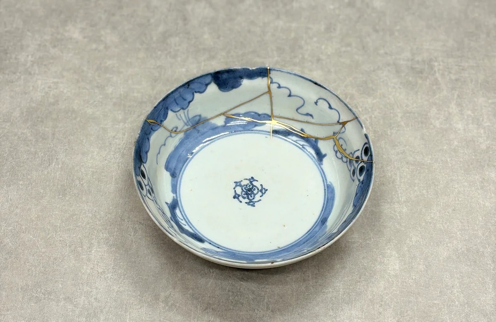
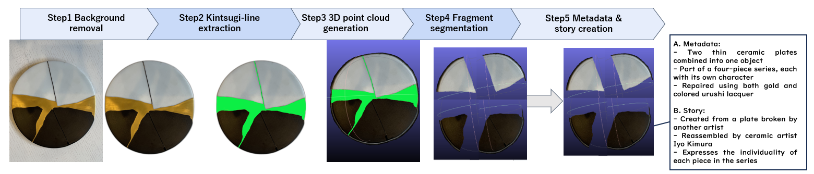
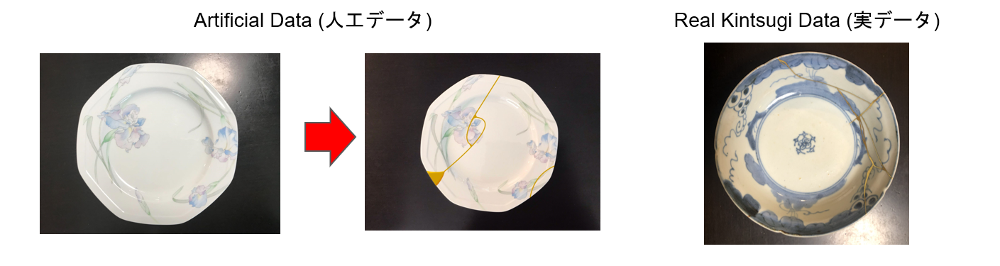

# Kintsugi Splitter
Digitally preserving the cultural and artistic value of kintsugi  
**by Nao Uematsu**

Kintsugi Splitter is a project dedicated to **preserving the cultural, artistic, and philosophical value of kintsugi**,  
the Japanese technique of repairing broken ceramics with gold.

Rather than treating breakage as damage, kintsugi embraces it as a part of the object’s history.  
Kintsugi Splitter continues this philosophy in the digital era by using **AI-based reconstruction, segmentation,  
and multimodal analysis** to archive repaired objects and make their stories accessible worldwide.



---

## Purpose

Modern digitization often captures only geometry or appearance.  
However, **kintsugi is not merely a physical repair technique—it is a philosophy** rooted in:

- *sustainability*
- *beauty in imperfection* 
- *human intention and emotion* 

**Kintsugi Splitter aims to preserve not only the shape,  
but also the cultural essence of kintsugi and share it globally.**

By combining:

- background removal  
- AI-based kintsugi-line extraction  
- 3D reconstruction using MoGe  
- fragment segmentation via DBSCAN  
- and structured narrative metadata generation  

the project creates a new form of digital cultural archive.


---
## Why Open Source?

We release Kintsugi Splitter openly so that people around the world  
can learn through kintsugi the value of repairing, cherishing,  
and sustaining a single object rather than replacing it.

This project aims to preserve not only techniques but also the  
cultural philosophy of kintsugi for future generations.

---

## Pipeline Overview

The Kintsugi Splitter pipeline consists of five stages:

1. **Background removal**  
   Removes photographic context to isolate the ceramic object.

2. **Kintsugi-line extraction (AI-assisted)**  
   Detects gold repair lines and generates precise masks for analysis.

3. **3D point cloud generation (MoGe)**  
   Reconstructs the object into a 3D point cloud with color.

4. **Fragment segmentation**  
   Removes gold lines and separates fragments using a two-stage DBSCAN method  
   based on local thickness estimation.

5. **Metadata & story creation**  
   Captures *material*, *origin*, *crafting environment*, and *artistic intent*  
   to preserve the cultural meaning behind the repair.

This multi-step pipeline allows Kintsugi Splitter to preserve both the **form** and the **spirit**  
of repaired objects.



---

## Usage (Minimal Working Pipeline)

This section describes the **minimal steps required to run the Kintsugi Splitter pipeline**.
Following these commands will reproduce the core workflow:
background removal → kintsugi-line detection → 3D reconstruction → fragment segmentation.

---

### 1. Install dependencies

```bash
pip install open3d
pip install opencv-python
pip install pillow
pip install rembg
pip install torch torchvision torchaudio --index-url https://download.pytorch.org/whl/cu121
pip install git+https://github.com/microsoft/MoGe.git
pip install google-generativeai
pip install scikit-learn
```

---

### 2. Set your Gemini API key

Linux / macOS:

```bash
export GEMINI_API_KEY="YOUR_API_KEY"
```

Windows (PowerShell):

```powershell
setx GEMINI_API_KEY "YOUR_API_KEY"
```

---

### 3. Prepare an input image

Place your kintsugi photo in the working directory:

```
input.png
```

---

### 4. Run the full minimal pipeline

```bash
python scripts/minimal_pipeline.py input.png output/
```

This will execute:

- Background removal  
- Kintsugi-line extraction  
- 3D point cloud reconstruction (MoGe)  
- Fragment segmentation (DBSCAN)

Resulting structure:

```
output/
    step1_removed.png
    step2_kintsugi.png
    pointcloud.ply
    fragments/
        piece_0.ply
        piece_1.ply
        ...
```

---

### 5. Visualize the point cloud

```python
import open3d as o3d
pcd = o3d.io.read_point_cloud("output/pointcloud.ply")
o3d.visualization.draw_geometries([pcd])
```

---

## minimal_pipeline.py (inside `/scripts`)

```python
"""
Minimal Working Pipeline for Kintsugi Splitter
Steps: Background removal → Kintsugi-line extraction → MoGe point cloud → DBSCAN fragments
"""

import os
import sys
import io
import cv2
import torch
import base64
import numpy as np
import open3d as o3d
from PIL import Image
from rembg import remove
from moge.model.v1 import MoGeModel
from google import generativeai as genai
from sklearn.neighbors import NearestNeighbors
from sklearn.cluster import DBSCAN


# ---------------- Step 1: Background removal ----------------
def step1_remove_background(input_path, out_path):
    with open(input_path, "rb") as f:
        data = f.read()
    output = remove(data)
    Image.open(io.BytesIO(output)).save(out_path)


# ---------------- Step 2: Kintsugi-line extraction ----------------
def step2_extract_kintsugi(input_path, out_path, api_key):
    genai.configure(api_key=api_key)
    model = genai.GenerativeModel("gemini-2.5-flash")

    prompt = (
        "Recolor ONLY the golden kintsugi repair lines into #0CEE45. "
        "Do not modify the plate. Return PNG."
    )

    with open(input_path, "rb") as f:
        img = f.read()

    res = model.generate_content(
        [prompt, {"mime_type": "image/png", "data": img}],
        generation_config={"response_mime_type": "image/png"}
    )

    out = base64.b64decode(res.text)
    with open(out_path, "wb") as f:
        f.write(out)


# ---------------- Step 3: MoGe 3D reconstruction ----------------
def step3_moge(input_img, out_ply):
    device = torch.device("cuda" if torch.cuda.is_available() else "cpu")
    model = MoGeModel.from_pretrained("Ruicheng/moge-vitl").to(device)

    img = cv2.cvtColor(cv2.imread(input_img), cv2.COLOR_BGR2RGB)
    img = torch.tensor(img / 255, dtype=torch.float32, device=device).permute(2, 0, 1)

    out = model.infer(img)
    pts = out["points"].detach().cpu().numpy()
    mask = out["mask"].detach().cpu().numpy() > 0

    pts = pts.squeeze()
    mask = mask.squeeze()
    valid_pts = pts[mask]

    pcd = o3d.geometry.PointCloud()
    pcd.points = o3d.utility.Vector3dVector(valid_pts)
    o3d.io.write_point_cloud(out_ply, pcd)


# ---------------- Step 4: Fragment segmentation ----------------
def step4_segment(pointcloud_path, out_dir):
    os.makedirs(out_dir, exist_ok=True)

    pcd = o3d.io.read_point_cloud(pointcloud_path)
    pts = np.asarray(pcd.points)

    nbrs = NearestNeighbors(n_neighbors=11).fit(pts)
    d, _ = nbrs.kneighbors(pts)
    m = (d[:, 1:].mean(axis=1) * 2).min()

    labels = DBSCAN(eps=m * 2, min_samples=20).fit_predict(pts)

    idx = 0
    for lbl in set(labels):
        if lbl == -1:
            continue
        frag = pts[labels == lbl]
        pc = o3d.geometry.PointCloud()
        pc.points = o3d.utility.Vector3dVector(frag)
        o3d.io.write_point_cloud(f"{out_dir}/piece_{idx}.ply", pc)
        idx += 1


# ---------------- Main ----------------
if __name__ == "__main__":
    inp = sys.argv[1]
    out = sys.argv[2]

    os.makedirs(out, exist_ok=True)

    api_key = os.getenv("GEMINI_API_KEY")
    if not api_key:
        raise ValueError("Set GEMINI_API_KEY first")

    step1_remove_background(inp, f"{out}/step1_removed.png")
    step2_extract_kintsugi(f"{out}/step1_removed.png", f"{out}/step2_kintsugi.png", api_key)
    step3_moge(f"{out}/step1_removed.png", f"{out}/pointcloud.ply")
    step4_segment(f"{out}/pointcloud.ply", f"{out}/fragments")

    print("Pipeline complete.")
```
## Dataset Types

Kintsugi Splitter works with two kinds of input images:

### Artificial Data (人工データ)
These images are **not actually broken nor repaired**.  
They are intact plates where **kintsugi-like lines were manually drawn using digital tools**  
(e.g., Photoshop) to simulate fracture patterns and gold repairs.  
This allows testing under controlled conditions.

### Real Kintsugi Data (実データ)
Images of **actual repaired ceramic works**, including yobitsugi and traditional kintsugi plates.




---

## Vision

Kintsugi Splitter is part of a larger initiative to create a **sustainable digital archive**  
that honors Japanese craftsmanship and spreads its values—including resilience, repair,  
and imperfect beauty—to a global audience.

By transforming physical objects into structured digital artifacts,  
we aim to build a foundation for future research in:

- cultural computing  
- AI-driven heritage preservation  
- multimodal understanding  
- sustainable design  

Kintsugi teaches that breakage is not an end, but a beginning.  
Kintsugi Splitter brings that message to the world.

---

## License

This project is released under the **MIT License**.

---

## Dissemination

Parts of this project were presented at:

- Information Processing Society of Japan (IPSJ), 2025  
- Science Conference 2025  
- JSEC 2025 (Japan Science & Engineering Challenge)

We release this project to help share the philosophy of kintsugi with the world  
and encourage a culture of repairing, valuing, and sustaining objects.

---

## Acknowledgements

Kintsugi practices, artworks, and cultural inspiration were provided with respect  
to the craftspeople and traditions that shaped them.  
We aim to support the preservation and global appreciation of this heritage.

---

##  References

### Background Removal
- Qin, X., Zhang, Z., Huang, C., Dehghani, M., Zaidi, S., Qin, Z., & Hou, Q.  
  **U²-Net: Going Deeper with Nested U-Structure for Salient Object Detection**.  
  *Pattern Recognition*, 2020.  
  https://github.com/NathanUA/U-2-Net

### 3D Reconstruction (MoGe)
- Ruicheng, W., et al.  
  **MoGe: Accurate Monocular Geometry Estimation for Open-Domain Images**.  
  *CVPR*, 2025.  
  https://github.com/microsoft/MoGe

### Clustering (Fragment Segmentation)
- Ester, M., Kriegel, H.-P., Sander, J., & Xu, X.  
  **A Density-Based Algorithm for Discovering Clusters in Large Spatial Databases with Noise (DBSCAN)**.  
  *KDD*, 1996.

### Multimodal Modeling (Google Gemini)
- Google DeepMind  
  **Gemini 2.5 Flash Model Card**, 2025.  
  https://ai.google.dev/gemini/

### Background Removal Tool
- danielgatis  
  **rembg: Image Background Removal**  
  GitHub Repository: https://github.com/danielgatis/rembg

  
---

## Citations

If you find **Kintsugi Splitter** useful in your research or projects, please cite:

```bibtex
@misc{Kintsugi-Splitter2025,
    title        = {Kintsugi Splitter},
    author       = {Nao Uematsu},
    year         = {2025},
    note         = {GitHub Repository},
    url          = {https://github.com/Tena-rin/Kintsugi-Splitter}
}
```


